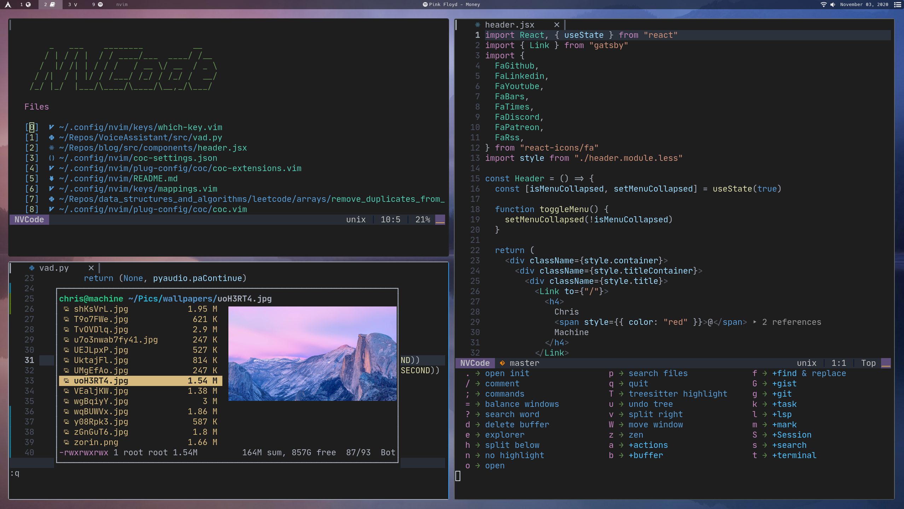

# NVCode



## Install Neovim

- Mac

  ```
  brew install --HEAD neovim # Nightly version

  brew upgrade neovim --fetch-HEAD # Sometimes you need to update
  ```

- Ubuntu

  Opt1: Automatic

  ```
  curl -l https://github.com/neovim/neovim/releases/download/nightly/nvim.appimage > /tmp/nvim.appimage

  sudo mv /tmp/nvim.appimage /usr/local/bin/nvim

  chmod +x /usr/local/bin/nvim
  ```

  Opt2: Manual
  Download appimage from:
  https://github.com/neovim/neovim/releases/nightly

  ```
  mv ~/Downloads/nvim.appimage /usr/local/bin/nvim

  # CUSTOM_NVIM_PATH=/usr/local/bin/nvim
  # Set the above with the correct path, then run the rest of the commands:
  set -u
  sudo update-alternatives --install /usr/bin/ex ex "${CUSTOM_NVIM_PATH}" 110
  sudo update-alternatives --install /usr/bin/vi vi "${CUSTOM_NVIM_PATH}" 110
  sudo update-alternatives --install /usr/bin/view view "${CUSTOM_NVIM_PATH}" 110
  sudo update-alternatives --install /usr/bin/vim vim "${CUSTOM_NVIM_PATH}" 110
  sudo update-alternatives --install /usr/bin/vimdiff vimdiff "${CUSTOM_NVIM_PATH}" 110
  ```

- Arch

  ```
  yay -S neovim-git # Latest
  ```

## Clone this repo into your config

```
git clone https://github.com/TikTzuki/nvim.git ~/.config/nvim
```

## Install python & node support

```
pip3 install pynvim
```

```
npm i -g neovim
```

## Install Neovim remote

```
pip install neovim-remote
```

This will install `nvr` to `~/.local/bin` so you will need to add the following to your `bashrc` or `zshrc`

```
export PATH=$HOME/.local/bin:$PATH
```

## Install clipboard support

- On Mac pbcopy should be builtin

- Ubuntu

  ```
  sudo apt install xsel
  ```

- Arch

  ```
  sudo pacman -S xsel
  ```

## (Optional) Install python & node support using virtual environments

Make sure to add these paths somewhere in your config

```
let g:python3_host_prog = expand("<path to python with pynvim installed>")
let g:python3_host_prog = expand("~/.miniconda/envs/neovim/bin/python3.8") " <- example

let g:node_host_prog = expand("<path to node with neovim installed>")
let g:node_host_prog = expand("~/.nvm/versions/node/v12.16.1/bin/neovim-node-host") " <- example
```

## List of programs you should install

- nodejs: sudo apt install nodejs
- npm: sudo apt install npm
- pip3: sudo apt-get install python3-pip
- pynvim: pip3 install pynvim
- fzf: sudo apt install fzf
- ranger: sudo apt install ranger
- ueberzug :
- ripgrep: sudo apt install ripgrep
- silver_searcher: sudo apt instsall silversearcher-ag
- fd: sudo apt install fd-find
- universal-ctags
- lazy git
- lazy docker

## Language Servers

Since CoC doesn't support all languages in there extensions
I recommend installing some language servers from scratch
and adding them to your `coc-settings.json` file

Example:

- bash

  `npm i -g bash-language-server`

  ```
  "languageserver": {
  "bash": {
    "command": "bash-language-server",
    "args": ["start"],
    "filetypes": ["sh"],
    "ignoredRootPaths": ["~"]
    }
  }
  ```

## For FAR to work

```
:UpdateRemotePlugins
```

## TabNine

To use TabNine enter the following in a buffer:

```
TabNine::config
```

**NOTE** This extension can take up a ton of memory

## Vim Gists

To use **vim-gists** you will need to configure the following:

```
git config --global github.user <username>
```

## VSCodium & Neo Vim Extension

[VSCodium](https://github.com/VSCodium/vscodium) contains build files to generate free release binaries of Microsoft's VS Code.

You can install it on multiple platforms:

- Mac

  ```
  brew cask install vscodium
  ```

- Arch

  ```
  yay -s vscodium-bin
  ```

- Snap

  ```
  snap install codium
  ```

[The Neo Vim Extension](https://github.com/asvetliakov/vscode-neovim) is available in the VSCode marketplace

I recommend using this alongside the VSCode `which-key` extension

Along with some of my config files you can find in `utils/vscode_config`

## TODO

- Better Documentation

## CoC extensions to check out

- coc-fzf-preview
  - https://github.com/yuki-ycino/fzf-preview.vim/
- coc-floaterm

## 0.5

- native lsp
- treesitter

## LOW PRIORITY TODO

If anyone reading this has any suggestions about implementing any of the following I will accept a PR, but these are not priority.

- ale
- multiple cursors
- markdown table
- galaxyline automatically grab colors from colorscheme
- tpope/vim-dadbod
- neovide
- People asked about vimwiki I kinda hate it but maybe I'll add it
- vimspector this is included but I don't plan on using it much
  - can be used with jdb, pdb, gdb, etc...
- nvim-dap and nvim-dap-virtual-text (ALL DEBUGGING IN NEOVIM IS CONFUSING AND HARD TO GET WORKING OR I'M JUST DUMB)
- later manually link pylance
- resize with arrows in addition to meta
- how to support meta key on for macOS?

## FOR JAVA DEVELOPMENT

- jre-14: sudo apt install openjdk-14-jre-headless
- jdk-14: sudo apt install openjdk-14-jdk-headless
- setup lombok
  ```
  sudo mkdir /usr/local/share/lombok
  sudo wget https://projectlombok.org/downloads/lombok.jar -O /usr/local/share/lombok/lombok.jar
  ```
